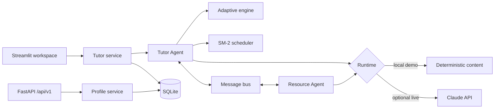

# Study Tutor Agent

[](https://github.com/PranaPragada7/Study-Tutor-Agent/actions/workflows/ci.yml)


Study Tutor is a local-first adaptive learning platform. It combines a polished
Streamlit workspace, a versioned FastAPI service, transactional SQLite student
memory, adaptive five-question sessions, SM-2 spaced repetition, progress
analytics, and collaborating Tutor and Resource agents.

The complete application works without an API key or paid service. If a local
Anthropic key is available and `live` mode is explicitly selected, Claude is
enabled; otherwise the same workflows use deterministic built-in tutoring content.

## Product experience

The dashboard makes the runtime, storage, and privacy boundary visible before a
student starts. A prepared sample workspace demonstrates adaptive practice,
learning-memory continuity, recommendations, progress, and diagnostics without
requiring account setup.

Key product capabilities:

- Professional responsive dashboard with onboarding, next-action guidance, and
  clear runtime status.
- Separate local student profiles with SQLite transactions and automatic import
  from the earlier JSON storage format.
- Adaptive course/topic/difficulty selection using an epsilon-greedy policy.
- Five-question practice sessions with confidence-aware feedback and saved reports.
- SM-2 review scheduling, mastery signals, strong/weak topic analysis, and durable chat.
- Tutor and Resource agents coordinated through an internal message bus.
- Deterministic local AI fallbacks plus optional Claude responses.
- Profile export, chat clearing, learning-state reset, and deletion controls.
- Structured telemetry, bounded history, prompt limits, retries, and error recovery.

## Architecture



The UI and local API share the profile domain and persistence layer. SQLite stores
versioned JSON-compatible profile documents so the learning engine remains isolated
from storage details while writes receive database transactions and indexed lookup.
The API is intentionally local-only and does not claim multi-user authentication.

## Run locally — no API key

Requirements: Python 3.10 or newer.

```powershell
git clone https://github.com/PranaPragada7/Study-Tutor-Agent.git
cd Study-Tutor-Agent

py -3.11 -m venv .venv
.\.venv\Scripts\Activate.ps1
python -m pip install -r requirements-dev.txt
python -m streamlit run app.py
```

Open [http://127.0.0.1:8501](http://127.0.0.1:8501) and choose **Open Sample
Workspace**. The default runtime is:

```text
STUDY_TUTOR_MODE=demo
STUDY_TUTOR_STORAGE=sqlite
```

Demo mode always selects the local tutor—even if a key already exists in your
shell. Nothing is hosted publicly and no paid request is made.

## Optional Claude mode

Copy `.env.example` to `.env`, add a valid Anthropic key, and set
`STUDY_TUTOR_MODE=live`:

```powershell
Copy-Item .env.example .env
notepad .env
python -m streamlit run app.py
```

Set `STUDY_TUTOR_MODE=demo` at any time to guarantee that no LLM request is made.

## Local API

Start the API separately:

```powershell
python -m uvicorn api:app --host 127.0.0.1 --port 8000 --reload
```

- Health: [http://127.0.0.1:8000/health](http://127.0.0.1:8000/health)
- OpenAPI: [http://127.0.0.1:8000/docs](http://127.0.0.1:8000/docs)
- Versioned resources: `/api/v1/profiles` and `/api/v1/profiles/{name}/summary`

Pydantic validates profile input, duplicate names return `409`, missing resources
return `404`, and the API reports its local runtime/storage mode through `/health`.

## Docker Compose

The Compose stack binds both services to loopback only and shares one local volume:

```powershell
docker compose up --build
```

- UI: [http://127.0.0.1:8501](http://127.0.0.1:8501)
- API: [http://127.0.0.1:8000/docs](http://127.0.0.1:8000/docs)

Stop it with `docker compose down`. Add `-v` only when you intentionally want to
delete the local student-data volume.

## Validate the project

```powershell
python scripts/preflight_check.py
ruff check .
ruff format --check .
python -m pytest --cov --cov-report=term-missing
docker compose config --quiet
```

The suite currently contains 241 tests and enforces a 70% branch-coverage floor.
GitHub Actions tests Python 3.10–3.13, validates formatting/linting, builds the
container image, and checks the Compose configuration. Tests never make live
Anthropic requests.

## Project structure

```text
app.py                    Streamlit product workspace
api.py                    Versioned local FastAPI service
services/runtime.py       Live/demo runtime and storage selection
agents/                   Tutor, Resource, adaptive, and prompt-safety logic
utils/profile_store.py    Transactional SQLite repository
utils/student_profile.py  Versioned profile domain and persistence boundary
utils/                    Message bus, SM-2, reports, telemetry, and diagnostics
ui/                       Reusable components and responsive visual system
tests/                    Unit, API, persistence, integration, and UI smoke tests
Dockerfile                Non-root local application image
docker-compose.yml        Loopback-only UI/API stack with shared data volume
```

## Security and deployment scope

This repository is deliberately a single-user local application. Docker ports bind
to `127.0.0.1`; local profiles may contain quiz answers and tutor conversations;
secrets and databases are ignored by Git. The local API is not suitable for shared
public deployment because it does not include authentication or per-user authorization.

A public or multi-user version would require identity, access control, encrypted
transport, retention policies, database migrations for normalized user ownership,
and production secret management. Those claims are intentionally not made here.

See [CHANGELOG.md](CHANGELOG.md) for release history.
