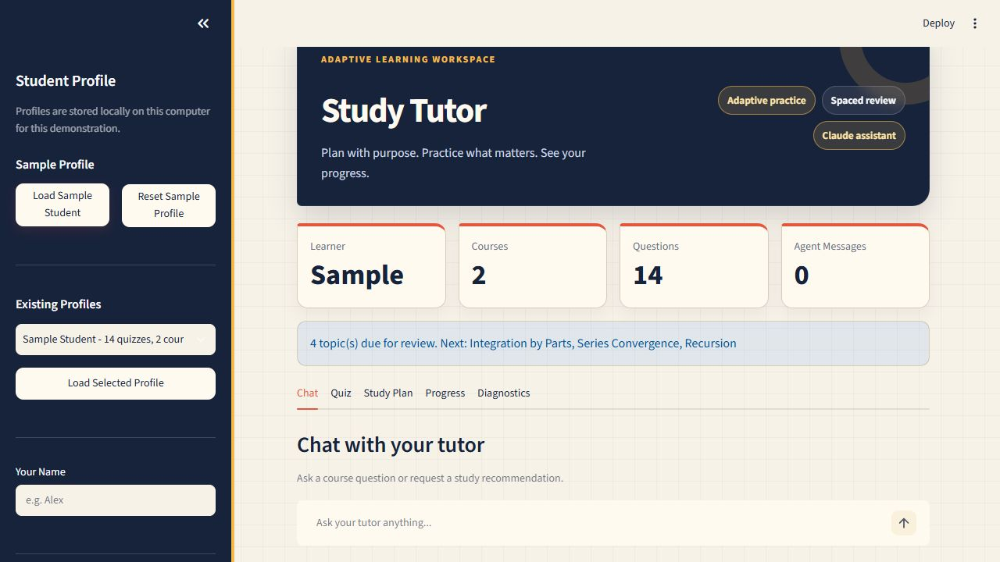
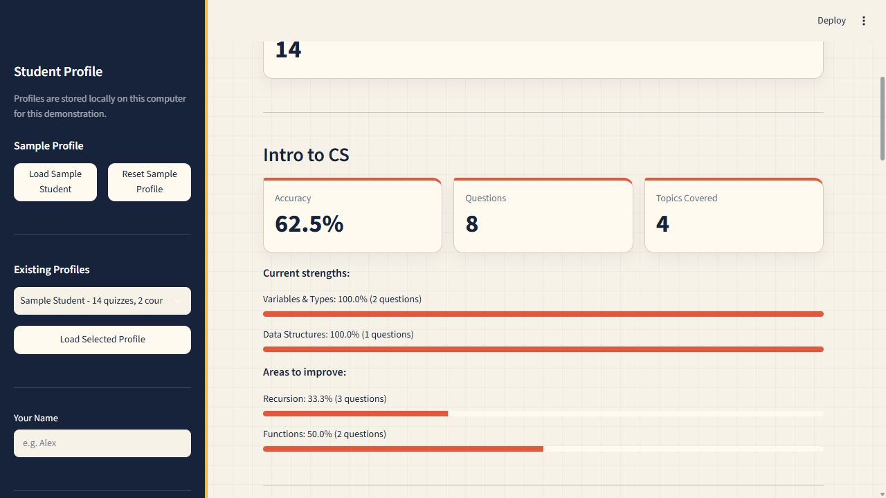
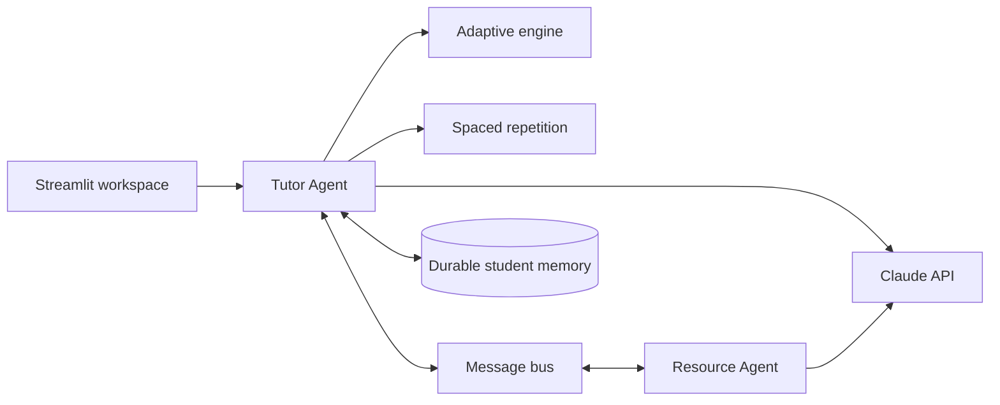

# Study Tutor Agent

[](https://github.com/PranaPragada7/Study-Tutor-Agent/actions/workflows/ci.yml)


Study Tutor is an adaptive-learning chatbot built with Streamlit and Claude. It combines personalized tutoring, five-question practice sessions, spaced repetition, durable student memory, progress tracking, and a collaborating Resource Agent in one application.

## Product tour



The workspace keeps chat, adaptive practice, study planning, progress, and diagnostics in one focused interface. A prepared sample student makes the learning-memory flow easy to evaluate without modifying personal data.



## What it does

- Keeps separate local profiles for courses, learning preferences, quiz history, and chatbot conversations.
- Selects topics and difficulty with an epsilon-greedy adaptive engine.
- Runs focused five-question sessions with confidence-aware feedback.
- Schedules review using the SM-2 spaced-repetition algorithm.
- Generates profile-aware explanations, quizzes, resources, and study plans with Claude.
- Coordinates a Tutor Agent and Resource Agent through an internal message bus.
- Remembers strong topics, weak topics, answers, confidence, tutor feedback, and completed conversations across restarts.
- Surfaces mastery, review dates, session reports, and diagnostic telemetry.
- Protects local state with atomic writes, file locks, schema migration, and bounded history.

## How it works



The Tutor Agent owns the student-facing flow. It reads the saved profile, restores prior conversations, supplies Claude with current strengths and weaknesses, records every quiz response, and updates the review schedule. When a student needs more support, it asks the Resource Agent for targeted material through the message bus.

## Run locally

Requirements: Python 3.10 or newer.

```powershell
git clone https://github.com/PranaPragada7/Study-Tutor-Agent.git
cd Study-Tutor-Agent

py -3.11 -m venv .venv
.\.venv\Scripts\Activate.ps1
python -m pip install -r requirements-dev.txt
```

Create a local environment file and add a valid Anthropic API key. The live Claude assistant is required:

```powershell
Copy-Item .env.example .env
notepad .env
python -m streamlit run app.py
```

The app opens at [http://localhost:8501](http://localhost:8501). Use **Load Sample Student** in the sidebar for a prepared walkthrough.

## Validate the project

```powershell
python scripts/preflight_check.py
ruff check .
ruff format --check .
python -m pytest --cov --cov-report=term-missing
```

Additional checks are available for the feedback loop, live flow, and a real Claude warm-up call:

```powershell
python scripts/feedback_check.py
python scripts/live_flow_check.py
python scripts/warmup_check.py
```

The pytest suite does not make live Anthropic requests. GitHub Actions enforces formatting, linting, a 70% branch-coverage floor, and compatibility across Python 3.10–3.13. `warmup_check.py` is the explicit live-Claude validation.

## Project structure

```text
app.py                 Streamlit interface and session workflow
config.py              Environment-driven runtime settings
agents/
  tutor_agent.py       Tutoring, quizzes, feedback, and study plans
  tutor_content.py     Stable tutor persona and fallback quiz content
  resource_agent.py    Learning-material generation and caching
  adaptive_engine.py   Topic and difficulty selection
utils/
  student_profile.py   Local profile persistence and migration
  spaced_repetition.py SM-2 review scheduling
  quiz_session.py      Five-question session reports
  agent_comm.py        Inter-agent message bus
  telemetry.py         Runtime counters and diagnostics
scripts/               Preflight and presentation checks
tests/                 Unit, integration, hardening, and UI smoke tests
ui/                    Streamlit theme and reusable report components
data/                  Sample profile; personal profiles stay untracked
```

## Deployment scope

This release is designed as a single-user local demonstration. Student profiles are JSON files on the machine running Streamlit, and the interface does not include user authentication. Before deploying it as a shared public service, replace local profile storage with a durable database, add per-user authentication and authorization, and define a retention policy for student conversations and quiz records.

## Data and security

Student profiles are stored locally as JSON files in `data/`. Each profile includes quiz answers, answer keys, explanations, tutor responses, confidence signals, strong and weak topics, spaced-review state, session reports, and bounded chatbot history. Personal profiles, `.env`, Streamlit secrets, virtual environments, caches, and lock files are excluded from Git.

Only placeholder values belong in `.env.example` and `.streamlit/secrets.toml.example`. If a real API key is ever shared or committed, revoke it in the Anthropic Console and create a new one.

## Release

See [CHANGELOG.md](CHANGELOG.md) for the presentation-ready `v1.0.0` feature set and validation summary.
